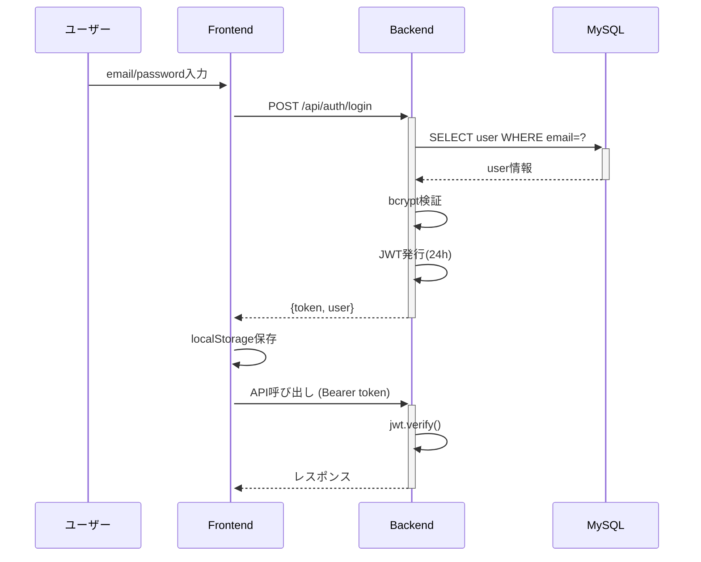

# 清掃写真・領収書共有システム 完全ドキュメント

**バージョン**: 1.0.0
**作成日**: 2025-12-14
**対象**: システム全体の包括的理解

---

## 目次

1. [システム概要](#1-システム概要)
2. [アーキテクチャ](#2-アーキテクチャ)
3. [ユーザー種別と権限](#3-ユーザー種別と権限)
4. [データベース設計](#4-データベース設計)
5. [API仕様](#5-api仕様)
6. [画面構成](#6-画面構成)
7. [主要機能詳細](#7-主要機能詳細)
8. [技術仕様](#8-技術仕様)
9. [運用ガイド](#9-運用ガイド)
10. [トラブルシューティング](#10-トラブルシューティング)

---

## 1. システム概要

### 1.1 目的

本システムは、清掃業務における写真記録と領収書の管理を効率化するWebアプリケーションです。現場スタッフが清掃前後の写真をスマートフォンから簡単にアップロードし、管理者とクライアントがそれらを確認・管理できます。

### 1.2 主要機能

- **写真管理**: 施設×日付単位で清掃前/後の写真を記録
- **領収書管理**: 施設×月単位で領収書PDFを保管
- **月次点検**: 換気扇・エアコンフィルターの定期点検記録
- **マルチクライアント**: 1施設に複数のクライアントを割当可能
- **自動削除**: 60日経過した写真を自動削除（ストレージ最適化）
- **統計ダッシュボード**: 日次アップロード数、月次完了率の可視化

### 1.3 技術スタック

| レイヤー | 技術 | バージョン |
|---------|------|-----------|
| フロントエンド | React (CRA) | 19.1.1 |
| バックエンド | Node.js + Express | 20.x / 4.18.2 |
| データベース | MySQL | 8.0+ |
| 認証 | JWT | - |
| ストレージ | ローカルファイルシステム | - |
| 画像処理 | sharp, heic-convert | 0.32.5 |
| スタイリング | Tailwind CSS (CDN) | 3.x |

**【スクリーンショット1】**: システム構成図（手書きまたはdiagram.net）
```
┌─────────────┐
│ スマホ/PC   │
│ (Browser)   │
└──────┬──────┘
       │ HTTPS
       ↓
┌─────────────────────────┐
│  React Frontend         │
│  Port: 3000             │
└──────────┬──────────────┘
           │ REST API
           ↓
┌─────────────────────────┐
│  Express Backend        │
│  Port: 8000             │
│  - JWT認証              │
│  - Multer (画像処理)    │
│  - Sharp (リサイズ)     │
└──────┬──────────┬───────┘
       │          │
       ↓          ↓
┌──────────┐  ┌──────────┐
│  MySQL   │  │ 本体FS   │
│  DB      │  │ uploads/ │
└──────────┘  └──────────┘
```

---

## 2. アーキテクチャ

### 2.1 ディレクトリ構造

```
cleaning-share/
├── backend/                 # Node.js サーバー
│   ├── server.js           # メインアプリケーション（全APIエンドポイント）
│   ├── database_schema.sql # DB スキーマ定義
│   ├── scripts/            # 運用スクリプト
│   │   ├── initDatabase.js       # 初期セットアップ
│   │   └── cleanupOldPhotos.js   # 写真削除バッチ
│   ├── src/cron/
│   │   └── retention.js    # 保持ポリシー実装
│   ├── uploads_dev/        # ファイル保存先
│   │   ├── photos/{facilityId}/{YYYY-MM}/{YYYY-MM-DD}/
│   │   └── receipts/{facilityId}/{YYYY-MM}/
│   └── logs/               # Winston ログ
│
├── frontend/               # React アプリ
│   ├── src/
│   │   ├── App.js         # ルーティング
│   │   ├── api/           # API通信層（10ファイル）
│   │   ├── components/    # UIコンポーネント（13ファイル）
│   │   └── utils/         # ユーティリティ（圧縮、バッチ等）
│   └── build/             # 本番ビルド
│
└── docs/                   # ドキュメント
    ├── USER_MANUAL_ADMIN.md
    ├── USER_MANUAL_STAFF.md
    └── USER_MANUAL_CLIENT.md
```

### 2.2 データフロー

```
【写真アップロード】
スタッフ画面 → 画像選択 → 圧縮(300KB) → FormData → API → Multer → Sharp処理 → FS保存 → DB登録

【アルバム閲覧】
クライアント画面 → API → 権限確認 → DB検索 → ファイルパス取得 → URL生成 → 遅延ロード表示
```

**【スクリーンショット2】**: データフロー図（詳細版、PlantUML等で作成）

### 2.3 認証フロー



---

## 3. ユーザー種別と権限

### 3.1 役割定義

| 役割 | 英語名 | 主な用途 |
|-----|--------|---------|
| 管理者 | admin | 全機能の利用・設定 |
| スタッフ | staff | 写真・領収書アップロード |
| クライアント | client | 閲覧のみ |

### 3.2 権限マトリクス

| 機能 | admin | staff | client |
|-----|-------|-------|--------|
| 施設管理（作成・編集・削除） | ✅ | ❌ | ❌ |
| ユーザー管理 | ✅ | ❌ | ❌ |
| 写真アップロード | ✅ | ✅ | ❌ |
| 領収書アップロード | ✅ | ✅ | ❌ |
| 月次点検入力 | ✅ | ✅ | ❌ |
| 写真閲覧（全施設） | ✅ | ✅ | ❌※ |
| 写真閲覧（割当施設のみ） | - | - | ✅ |
| 領収書閲覧（割当施設のみ） | ✅ | ✅ | ✅ |
| ZIP一括ダウンロード | ✅ | ✅ | ✅ |
| 写真・領収書削除 | ✅ | ❌ | ❌ |
| 統計閲覧 | ✅ | ❌ | ❌ |

※ クライアントは`facility_clients`テーブルで割り当てられた施設のみアクセス可能

### 3.3 初期ユーザー

システム初期化時に以下のユーザーが作成されます：

```sql
-- 管理者
email: admin@cleaning.com
password: admin123

-- スタッフ
email: staff1@cleaning.com
password: staff123

-- クライアント
email: client1@example.com
password: client123
```

**【スクリーンショット3】**: ログイン画面
- メールアドレス入力フィールド
- パスワード入力フィールド（デフォルトで表示状態）
- ログインボタン

---

## 4. データベース設計

### 4.1 ER図

```
users (ユーザー)
  ├── id (PK)
  ├── email (UNIQUE)
  ├── password_hash
  ├── name
  ├── role (admin/staff/client)
  └── is_active

facilities (施設)
  ├── id (PK)
  ├── name
  ├── address
  ├── client_user_id (DEPRECATED)
  └── is_deleted

facility_clients (施設×クライアント 多対多)
  ├── id (PK)
  ├── facility_id (FK → facilities)
  ├── client_user_id (FK → users)
  ├── assigned_at
  └── removed_at

cleaning_sessions (清掃セッション)
  ├── id (PK)
  ├── facility_id (FK → facilities)
  ├── cleaning_date (DATE)
  ├── staff_user_id (FK → users)
  ├── ventilation_checked (月次点検)
  └── air_filter_checked (月次点検)

photos (写真)
  ├── id (PK)
  ├── cleaning_session_id (FK → cleaning_sessions)
  ├── file_path
  ├── thumbnail_path
  ├── type (before/after/general)
  ├── file_size
  ├── original_name
  └── uploaded_at

receipts (領収書)
  ├── id (PK)
  ├── cleaning_session_id (FK, nullable)
  ├── facility_id (FK → facilities)
  ├── month (YYYY-MM)
  ├── file_path
  ├── file_size
  ├── original_name
  ├── uploaded_by (FK → users)
  └── uploaded_at
```

**【スクリーンショット4】**: ER図（MySQL Workbench、draw.io等）

### 4.2 テーブル詳細

#### 4.2.1 users（ユーザー）

```sql
CREATE TABLE users (
  id INT PRIMARY KEY AUTO_INCREMENT,
  email VARCHAR(190) NOT NULL UNIQUE,
  password_hash VARCHAR(255) NOT NULL,
  name VARCHAR(100) NOT NULL,
  role ENUM('staff','client','admin') NOT NULL DEFAULT 'staff',
  is_active BOOLEAN NOT NULL DEFAULT TRUE,
  created_at TIMESTAMP NOT NULL DEFAULT CURRENT_TIMESTAMP,
  INDEX idx_user_email (email),
  INDEX idx_user_role (role)
) ENGINE=InnoDB DEFAULT CHARSET=utf8mb4 COLLATE=utf8mb4_unicode_ci;
```

**役割**:
- システムユーザー情報を管理
- パスワードはbcryptでハッシュ化（cost=10）
- `is_active=FALSE`で論理削除

#### 4.2.2 facilities（施設）

```sql
CREATE TABLE facilities (
  id INT PRIMARY KEY AUTO_INCREMENT,
  name VARCHAR(150) NOT NULL,
  address VARCHAR(255),
  client_user_id INT,  -- DEPRECATED: facility_clientsを使用
  is_deleted BOOLEAN DEFAULT FALSE,
  created_at TIMESTAMP NOT NULL DEFAULT CURRENT_TIMESTAMP,
  FOREIGN KEY (client_user_id) REFERENCES users(id) ON DELETE SET NULL,
  INDEX idx_fac_deleted (is_deleted)
) ENGINE=InnoDB DEFAULT CHARSET=utf8mb4 COLLATE=utf8mb4_unicode_ci;
```

**ポイント**:
- `is_deleted=TRUE`で論理削除（データ保持）
- `client_user_id`は旧仕様（現在は`facility_clients`で管理）

#### 4.2.3 facility_clients（施設×クライアント）

```sql
CREATE TABLE facility_clients (
  id INT PRIMARY KEY AUTO_INCREMENT,
  facility_id INT NOT NULL,
  client_user_id INT NOT NULL,
  assigned_at TIMESTAMP NOT NULL DEFAULT CURRENT_TIMESTAMP,
  removed_at TIMESTAMP NULL,
  UNIQUE KEY unique_facility_client (facility_id, client_user_id),
  FOREIGN KEY (facility_id) REFERENCES facilities(id) ON DELETE CASCADE,
  FOREIGN KEY (client_user_id) REFERENCES users(id) ON DELETE CASCADE,
  INDEX idx_fc_facility (facility_id),
  INDEX idx_fc_client (client_user_id)
) ENGINE=InnoDB DEFAULT CHARSET=utf8mb4 COLLATE=utf8mb4_unicode_ci;
```

**マルチクライアント対応**:
```sql
-- 施設1にクライアント10, 11を割当
INSERT INTO facility_clients (facility_id, client_user_id) VALUES (1, 10), (1, 11);

-- クライアント10がアクセス可能な施設を取得
SELECT f.* FROM facilities f
INNER JOIN facility_clients fc ON f.id = fc.facility_id
WHERE fc.client_user_id = 10 AND fc.removed_at IS NULL;
```

#### 4.2.4 cleaning_sessions（清掃セッション）

```sql
CREATE TABLE cleaning_sessions (
  id INT PRIMARY KEY AUTO_INCREMENT,
  facility_id INT NOT NULL,
  cleaning_date DATE NOT NULL DEFAULT (CURRENT_DATE),
  staff_user_id INT,
  ventilation_checked BOOLEAN NOT NULL DEFAULT FALSE,
  air_filter_checked BOOLEAN NOT NULL DEFAULT FALSE,
  created_at TIMESTAMP NOT NULL DEFAULT CURRENT_TIMESTAMP,
  FOREIGN KEY (facility_id) REFERENCES facilities(id) ON DELETE CASCADE,
  FOREIGN KEY (staff_user_id) REFERENCES users(id) ON DELETE SET NULL,
  INDEX idx_cs_fac_date (facility_id, cleaning_date)
) ENGINE=InnoDB DEFAULT CHARSET=utf8mb4 COLLATE=utf8mb4_unicode_ci;
```

**アルバム単位**:
- 1施設×1日付 = 1セッション
- 写真と領収書の親エンティティ

#### 4.2.5 photos（写真）

```sql
CREATE TABLE photos (
  id INT PRIMARY KEY AUTO_INCREMENT,
  cleaning_session_id INT NOT NULL,
  file_path VARCHAR(500) NOT NULL,
  thumbnail_path VARCHAR(500),
  type ENUM('before','after','general') NOT NULL DEFAULT 'general',
  file_size INT,
  original_name VARCHAR(255),
  uploaded_at TIMESTAMP NOT NULL DEFAULT CURRENT_TIMESTAMP,
  FOREIGN KEY (cleaning_session_id) REFERENCES cleaning_sessions(id) ON DELETE CASCADE,
  INDEX idx_ph_session (cleaning_session_id),
  INDEX idx_ph_uploaded (uploaded_at)
) ENGINE=InnoDB DEFAULT CHARSET=utf8mb4 COLLATE=utf8mb4_unicode_ci;
```

**ファイルパス例**:
```
file_path: photos/1/2024-12/2024-12-14/fac-1_20241214_before_abc123.jpg
thumbnail_path: photos/1/2024-12/2024-12-14/thumbnails/thumb_fac-1_20241214_before_abc123.jpg
```

#### 4.2.6 receipts（領収書）

```sql
CREATE TABLE receipts (
  id INT PRIMARY KEY AUTO_INCREMENT,
  cleaning_session_id INT,
  facility_id INT NOT NULL,
  month VARCHAR(7) NOT NULL,  -- YYYY-MM
  file_path VARCHAR(512) NOT NULL,
  file_size INT,
  original_name VARCHAR(255),
  uploaded_by INT,
  uploaded_at TIMESTAMP NOT NULL DEFAULT CURRENT_TIMESTAMP,
  FOREIGN KEY (cleaning_session_id) REFERENCES cleaning_sessions(id) ON DELETE CASCADE,
  FOREIGN KEY (facility_id) REFERENCES facilities(id) ON DELETE CASCADE,
  FOREIGN KEY (uploaded_by) REFERENCES users(id) ON DELETE SET NULL,
  INDEX idx_rec_facility_month (facility_id, month)
) ENGINE=InnoDB DEFAULT CHARSET=utf8mb4 COLLATE=utf8mb4_unicode_ci;
```

**月次管理**:
```
file_path: receipts/1/2024-12/fac-1_202412_receipt_abc123.pdf
month: 2024-12
```

---

## 5. API仕様

### 5.1 エンドポイント一覧

#### 認証系

| メソッド | エンドポイント | 認証 | 役割 | 説明 |
|---------|---------------|------|------|------|
| POST | `/api/auth/login` | 不要 | - | ログイン（JWT発行） |
| GET | `/api/auth/me` | 要 | 全員 | 現在のユーザー情報取得 |
| GET | `/api/auth/verify` | 要 | 全員 | トークン検証 |
| POST | `/api/auth/change-password` | 要 | 全員 | パスワード変更 |

**ログインリクエスト例**:
```json
POST /api/auth/login
Content-Type: application/json

{
  "email": "staff1@cleaning.com",
  "password": "staff123"
}
```

**レスポンス例**:
```json
{
  "token": "eyJhbGciOiJIUzI1NiIsInR5cCI6IkpXVCJ9...",
  "user": {
    "id": 3,
    "email": "staff1@cleaning.com",
    "name": "山田太郎",
    "role": "staff",
    "facilities": [1, 2, 3]
  }
}
```

#### ユーザー管理（admin のみ）

| メソッド | エンドポイント | 説明 |
|---------|---------------|------|
| GET | `/api/users` | ユーザー一覧取得 |
| POST | `/api/users` | ユーザー作成 |
| PUT | `/api/users/:userId` | ユーザー更新 |
| PUT | `/api/users/:userId/reset-password` | パスワードリセット |
| DELETE | `/api/users/:userId` | ユーザー削除 |

**ユーザー作成リクエスト例**:
```json
POST /api/users
Content-Type: application/json
Authorization: Bearer {token}

{
  "email": "staff2@cleaning.com",
  "password": "staff456",
  "name": "佐藤花子",
  "role": "staff"
}
```

**【スクリーンショット5】**: 管理者画面 - ユーザー管理タブ
- ユーザー一覧テーブル
- 新規作成モーダル
- 編集/削除ボタン

#### 施設管理

| メソッド | エンドポイント | 役割 | 説明 |
|---------|---------------|------|------|
| GET | `/api/facilities` | 全員 | 施設一覧（権限フィルター適用） |
| POST | `/api/facilities` | admin | 施設作成 |
| PUT | `/api/facilities/:id` | admin | 施設更新 |
| DELETE | `/api/facilities/:id` | admin | 施設削除 |
| GET | `/api/facilities/:id/clients` | admin | 割当クライアント一覧 |
| POST | `/api/facilities/:id/clients` | admin | クライアント割当 |
| DELETE | `/api/facilities/:id/clients/:clientId` | admin | クライアント削除 |

**施設作成（複数クライアント割当）**:
```json
POST /api/facilities
Content-Type: application/json
Authorization: Bearer {token}

{
  "name": "東京支店",
  "address": "東京都渋谷区1-2-3",
  "clientUserIds": [10, 11, 12]
}
```

**【スクリーンショット6】**: 管理者画面 - 施設管理タブ
- 施設一覧テーブル
- 施設作成モーダル（複数クライアント選択UI）
- 編集/削除ボタン

#### 写真管理

| メソッド | エンドポイント | 役割 | 説明 |
|---------|---------------|------|------|
| POST | `/api/photos/upload` | admin, staff | 写真アップロード（最大200枚） |
| GET | `/api/albums/:facilityId` | 全員 | アルバム取得（?date=YYYY-MM-DD） |
| GET | `/api/albums/:facilityId/:sessionId/download` | 全員 | ZIP一括ダウンロード |
| DELETE | `/api/photos/:id` | admin | 写真削除 |

**写真アップロードリクエスト**:
```
POST /api/photos/upload
Content-Type: multipart/form-data
Authorization: Bearer {token}

FormData:
  facilityId: 1
  date: "2024-12-14"  (オプション、省略時は今日)
  type: "before"      (or "after")
  photos: [File1, File2, File3, ...]
```

**レスポンス例**:
```json
{
  "success": true,
  "sessionId": 42,
  "files": [
    {
      "id": 1001,
      "filename": "fac-1_20241214_before_abc123.jpg",
      "type": "before",
      "size": 1048576,
      "url": "/uploads/photos/1/2024-12/2024-12-14/fac-1_20241214_before_abc123.jpg",
      "thumbnailUrl": "/uploads/photos/1/2024-12/2024-12-14/thumbnails/thumb_fac-1_20241214_before_abc123.jpg"
    }
  ],
  "message": "3枚の写真をアップロードしました"
}
```

**【スクリーンショット7】**: スタッフ画面 - 写真アップロード
- 施設選択ドロップダウン
- 写真タイプ選択（before/after）
- ドラッグ&ドロップエリア
- プレビュー画像
- アップロード進捗バー

#### 領収書管理

| メソッド | エンドポイント | 役割 | 説明 |
|---------|---------------|------|------|
| GET | `/api/receipts/:facilityId` | 全員 | 領収書一覧（?month=YYYY-MM） |
| POST | `/api/receipts/upload` | admin, staff | 領収書アップロード |
| DELETE | `/api/receipts/:id` | admin | 領収書削除 |

**領収書アップロードリクエスト**:
```
POST /api/receipts/upload
Content-Type: multipart/form-data
Authorization: Bearer {token}

FormData:
  facilityId: 1
  month: "2024-12"  (YYYY-MM形式)
  receipts: [File1.pdf, File2.pdf, ...]
```

**【スクリーンショット8】**: スタッフ画面 - 領収書アップロード
- 月選択（年月ピッカー）
- ファイル選択（複数対応）
- アップロードボタン

#### 月次点検

| メソッド | エンドポイント | 役割 | 説明 |
|---------|---------------|------|------|
| POST | `/api/monthly-checks/save` | admin, staff | 月次点検保存 |
| GET | `/api/monthly-checks/:facilityId` | 全員 | 施設の点検状態（?month=YYYY-MM） |
| GET | `/api/monthly-checks` | admin | 全施設の点検状況 |
| GET | `/api/monthly-checks/stats` | admin | 月次点検統計 |

**月次点検保存リクエスト**:
```json
POST /api/monthly-checks/save
Content-Type: application/json
Authorization: Bearer {token}

{
  "facilityId": 1,
  "sessionId": 42,
  "ventilation": true,
  "airFilter": false
}
```

**統計レスポンス例**:
```json
{
  "month": "2024-12",
  "total_facilities": 10,
  "ventilation_completed": 8,
  "air_filter_completed": 7,
  "both_completed": 6,
  "completion_rate": {
    "ventilation": 80,
    "air_filter": 70,
    "both": 60
  }
}
```

**【スクリーンショット9】**: 管理者画面 - 月次点検ダッシュボード
- 完了率グラフ
- 施設別点検状況テーブル

#### 統計（admin のみ）

| メソッド | エンドポイント | 説明 |
|---------|---------------|------|
| GET | `/api/stats/daily` | 日次統計 |
| GET | `/api/stats/recent-uploads` | 最近のアップロード履歴 |

---

## 6. 画面構成

### 6.1 ログイン画面

**パス**: `/`（未認証時）

**機能**:
- メールアドレス入力
- パスワード入力（デフォルトで表示、トグル可能）
- ログインボタン
- エラーメッセージ表示

**【スクリーンショット10】**: ログイン画面（全体）

### 6.2 スタッフ画面

**パス**: `/`（role=staff）

**タブ構成**:
1. 写真アップロード
2. 領収書
3. 月次点検

#### タブ1: 写真アップロード

**機能**:
- 施設検索（名前でフィルタ）
- 施設ソート（名前順、作成日順）
- 施設選択
- 日付選択（デフォルト: 今日）
- 写真タイプ選択（before/after）
- ドラッグ&ドロップ
- 複数選択（最大200枚）
- プレビュー表示
- 削除ボタン
- アップロードボタン
- 進捗バー表示

**【スクリーンショット11】**: スタッフ画面 - 写真タブ（全体）
**【スクリーンショット12】**: 写真プレビュー（複数枚選択時）
**【スクリーンショット13】**: アップロード進捗バー

#### タブ2: 領収書

**機能**:
- 施設選択
- 月選択（YYYY-MM）
- ファイル選択（PDF、画像）
- アップロードボタン

**【スクリーンショット14】**: スタッフ画面 - 領収書タブ

#### タブ3: 月次点検

**機能**:
- 施設選択
- 換気扇チェックボックス
- エアコンフィルターチェックボックス
- 保存ボタン
- 完了状態表示

**【スクリーンショット15】**: スタッフ画面 - 月次点検タブ

### 6.3 クライアント画面

**パス**: `/`（role=client）

**タブ構成**:
1. 清掃記録（写真）
2. 領収書

#### タブ1: 清掃記録

**機能**:
- 割当施設選択
- 日付フィルター
- before/after タブ切替
- サムネイル表示（遅延ロード）
- 画像クリック → モーダル拡大
- 前/次ナビゲーション
- キーボード操作（矢印、ESC）
- ZIP一括ダウンロード

**【スクリーンショット16】**: クライアント画面 - 清掃記録タブ
**【スクリーンショット17】**: 画像拡大モーダル（全画面）
**【スクリーンショット18】**: before/afterタブ切替

#### タブ2: 領収書

**機能**:
- 月別グループ表示
- PDFプレビュー
- ダウンロードボタン

**【スクリーンショット19】**: クライアント画面 - 領収書タブ

### 6.4 管理者画面

**パス**: `/`（role=admin）

**タブ構成**:
1. 統計ダッシュボード
2. 施設管理
3. ユーザー管理
4. アルバム閲覧
5. 月次点検

#### タブ1: 統計ダッシュボード

**表示項目**:
- 今日のアップロード数
- 総施設数
- アクティブユーザー数
- 最近のアップロード履歴（施設名、日時、枚数）

**【スクリーンショット20】**: 管理者画面 - 統計タブ

#### タブ2: 施設管理

**機能**:
- 施設一覧テーブル
- 新規作成ボタン
- 編集/削除ボタン
- クライアント割当管理（複数選択）

**【スクリーンショット21】**: 管理者画面 - 施設管理タブ
**【スクリーンショット22】**: 施設作成モーダル（複数クライアント選択）

#### タブ3: ユーザー管理

**機能**:
- ユーザー一覧テーブル（email、名前、役割、ステータス）
- 新規作成ボタン
- 編集/削除/パスワードリセットボタン

**【スクリーンショット23】**: 管理者画面 - ユーザー管理タブ
**【スクリーンショット24】**: ユーザー作成モーダル

#### タブ4: アルバム閲覧

クライアント画面と同様の機能（全施設アクセス可能）

#### タブ5: 月次点検

**機能**:
- 全施設の点検状況テーブル
- 完了率統計
- 月選択

**【スクリーンショット25】**: 管理者画面 - 月次点検タブ

---

## 7. 主要機能詳細

### 7.1 画像処理パイプライン

#### 7.1.1 フロントエンド側圧縮

**使用ライブラリ**: browser-image-compression

**設定** (`src/utils/imageCompression.js`):
```javascript
const options = {
  maxSizeMB: 0.3,              // 最大300KB
  maxWidthOrHeight: 1600,      // 長辺1600px
  fileType: 'image/jpeg',      // JPEG統一
  initialQuality: 0.8,         // 品質80%
  useWebWorker: true           // UIブロック防止
};
```

**処理フロー**:
```
1. HEIC/HEIF判定 → スキップ（サーバー処理）
2. その他の形式 → 圧縮
3. 5枚ずつ並列処理
4. FormDataに追加
```

#### 7.1.2 バックエンド側処理

**HEIC→JPEG変換**:
```javascript
// heic-convert 使用
const jpegBuffer = await convert({
  buffer: heicBuffer,
  format: 'JPEG',
  quality: 1  // 最高品質で変換
});

// sharp でリサイズ
await sharp(jpegBuffer)
  .resize(1600, 1600, {
    fit: 'inside',
    withoutEnlargement: true
  })
  .jpeg({ quality: 80 })
  .toFile(jpegPath);
```

**サムネイル生成**:
```javascript
const thumbDir = path.join(path.dirname(finalPath), 'thumbnails');
await sharp(finalPath)
  .resize(400, 400, {
    fit: 'inside',
    withoutEnlargement: true
  })
  .jpeg({ quality: 80 })
  .toFile(thumbnailPath);
```

**【スクリーンショット26】**: 画像処理フロー図（詳細）

### 7.2 バッチアップロード

**実装** (`src/utils/batchUpload.js`):

```javascript
設定:
- BATCH_SIZE: 5枚
- MAX_RETRIES: 3回
- RETRY_DELAY: 1秒

処理:
1. ファイル配列を5枚ずつ分割
2. 各バッチを順次アップロード
3. 失敗時は3回までリトライ
4. 進捗をコールバックで通知
```

**例**: 50枚アップロード
```
Batch 1: 5枚 → アップロード → 成功
Batch 2: 5枚 → アップロード → 失敗 → リトライ → 成功
...
Batch 10: 5枚 → アップロード → 成功

進捗: 10/50枚完了 (20%)
```

### 7.3 遅延ロード（LazyImage）

**実装** (`src/components/LazyImage.js`):

```javascript
// Intersection Observer API 使用
const observer = new IntersectionObserver((entries) => {
  entries.forEach(entry => {
    if (entry.isIntersecting) {
      // 画像読み込み開始
      setImageSrc(src);
      observer.unobserve(entry.target);
    }
  });
});
```

**効果**:
- 初期ロード時間短縮
- 帯域削減
- スムーズなスクロール

**【スクリーンショット27】**: 遅延ロード（スクロール時の読み込み）

### 7.4 自動削除・保持ポリシー

#### 実装

**スクリプト**: `backend/scripts/cleanupOldPhotos.js`

```javascript
async function cleanupOldPhotos() {
  const retentionDays = process.env.RETENTION_DAYS_PHOTO || 60;
  const cutoffDate = new Date();
  cutoffDate.setDate(cutoffDate.getDate() - retentionDays);

  // 1. 古いファイルパスを取得
  const [oldPhotos] = await db.query(
    'SELECT file_path, thumbnail_path FROM photos WHERE uploaded_at < ?',
    [cutoffDate]
  );

  // 2. ファイル削除
  for (const photo of oldPhotos) {
    fs.unlinkSync(path.join(STORAGE_ROOT, photo.file_path));
    fs.unlinkSync(path.join(STORAGE_ROOT, photo.thumbnail_path));
  }

  // 3. DBレコード削除
  await db.query('DELETE FROM photos WHERE uploaded_at < ?', [cutoffDate]);

  logger.info(`写真削除処理完了: ${oldPhotos.length}件削除`);
}
```

#### 実行方法

**手動実行**:
```bash
cd backend
npm run cleanup
```

**スケジュール実行** (crontab):
```
0 2 * * * cd /var/www/cleaning-share/backend && npm run cleanup
```

**ログ確認**:
```bash
tail -f backend/logs/combined.log
```

**【スクリーンショット28】**: ログ出力例（削除処理）

---

## 8. 技術仕様

### 8.1 環境変数

#### バックエンド (.env)

```env
# サーバー
PORT=8000
NODE_ENV=production

# データベース
DB_HOST=localhost
DB_USER=cleaning_user
DB_PASSWORD=your_strong_password
DB_NAME=cleaning_system

# JWT
JWT_SECRET=your-256bit-random-key

# ストレージ
STORAGE_ROOT=./uploads_dev
UPLOAD_DIR=./uploads_dev

# 保持ポリシー
RETENTION_DAYS_PHOTO=60
RETENTION_DAYS_BUNDLE=365

# CORS
CORS_ORIGIN=http://localhost:3000
```

#### フロントエンド (.env)

```env
REACT_APP_API_URL=http://localhost:8000/api
```

### 8.2 依存関係

#### バックエンド (package.json)

```json
{
  "dependencies": {
    "express": "^4.18.2",
    "mysql2": "^3.6.5",
    "bcrypt": "^5.1.1",
    "jsonwebtoken": "^9.0.2",
    "multer": "^1.4.5-lts.1",
    "sharp": "^0.32.5",
    "heic-convert": "^2.1.0",
    "archiver": "^6.0.1",
    "winston": "^3.11.0",
    "cors": "^2.8.5",
    "dotenv": "^16.3.1",
    "express-rate-limit": "^7.1.5",
    "node-cron": "^3.0.3"
  }
}
```

#### フロントエンド (package.json)

```json
{
  "dependencies": {
    "react": "^19.1.1",
    "react-dom": "^19.1.1",
    "browser-image-compression": "^2.0.2",
    "lucide-react": "^0.263.1",
    "pdfjs-dist": "^3.11.174"
  }
}
```

### 8.3 セキュリティ

#### 認証

- **JWT有効期限**: 24時間
- **パスワードハッシュ**: bcrypt (cost=10)
- **トークン検証**: 全APIエンドポイント（一部除く）

#### CORS

```javascript
app.use(cors({
  origin: process.env.CORS_ORIGIN,  // 固定オリジンのみ
  credentials: true
}));
```

#### レート制限

```javascript
const limiter = rateLimit({
  windowMs: 15 * 60 * 1000,  // 15分
  max: 500                    // 最大500リクエスト
});
app.use(limiter);
```

#### ファイルバリデーション

```javascript
// 写真
const photoFilter = (req, file, cb) => {
  const allowedMimes = ['image/jpeg', 'image/png', 'image/gif', 'image/webp', 'image/heic', 'image/heif'];
  if (allowedMimes.includes(file.mimetype)) {
    cb(null, true);
  } else {
    cb(new Error('無効なファイル形式です'));
  }
};

// 領収書
const receiptFilter = (req, file, cb) => {
  const allowedMimes = ['application/pdf', 'image/jpeg', 'image/png', 'image/gif', 'image/webp'];
  if (allowedMimes.includes(file.mimetype)) {
    cb(null, true);
  } else {
    cb(new Error('無効なファイル形式です'));
  }
};
```

### 8.4 ロギング

**Winston設定**:

```javascript
const logger = winston.createLogger({
  level: 'info',
  format: winston.format.combine(
    winston.format.timestamp(),
    winston.format.json()
  ),
  transports: [
    new winston.transports.File({ filename: 'logs/error.log', level: 'error' }),
    new winston.transports.File({ filename: 'logs/combined.log' })
  ]
});
```

**ログ例**:
```json
{
  "level": "info",
  "message": "写真アップロード成功: 施設1, 3枚",
  "timestamp": "2024-12-14T10:30:45.123Z",
  "userId": 3,
  "facilityId": 1
}
```

---

## 9. 運用ガイド

### 9.1 初期セットアップ

#### 1. データベース作成

```bash
mysql -u root -p
```

```sql
CREATE DATABASE cleaning_system CHARACTER SET utf8mb4 COLLATE utf8mb4_unicode_ci;
CREATE USER 'cleaning_user'@'localhost' IDENTIFIED BY 'your_password';
GRANT ALL PRIVILEGES ON cleaning_system.* TO 'cleaning_user'@'localhost';
FLUSH PRIVILEGES;
```

#### 2. スキーマ＆初期データ投入

```bash
cd backend
npm install
npm run init-db
```

**実行内容**:
- テーブル作成
- 初期ユーザー作成（admin, staff, client）
- インデックス作成

#### 3. バックエンド起動

```bash
cd backend
cp .env.example .env
# .env を編集（DB接続情報、JWT_SECRET等）
npm start
```

#### 4. フロントエンド起動

```bash
cd frontend
npm install
npm start
```

ブラウザで `http://localhost:3000` にアクセス

### 9.2 本番デプロイ

#### 1. フロントエンドビルド

```bash
cd frontend
REACT_APP_API_URL=https://yourdomain.com/api npm run build
```

#### 2. Nginxでホスティング

```nginx
server {
    listen 80;
    server_name yourdomain.com;

    # フロントエンド
    location / {
        root /var/www/cleaning-share/frontend/build;
        try_files $uri /index.html;
    }

    # API
    location /api {
        proxy_pass http://localhost:8000;
        proxy_http_version 1.1;
        proxy_set_header Upgrade $http_upgrade;
        proxy_set_header Connection 'upgrade';
        proxy_set_header Host $host;
        proxy_cache_bypass $http_upgrade;
    }

    # 静的ファイル
    location /uploads {
        alias /var/www/cleaning-share/backend/uploads_dev;
        expires 30d;
    }
}
```

#### 3. PM2でバックエンド起動

```bash
npm install -g pm2
cd /var/www/cleaning-share/backend
pm2 start server.js --name cleaning-api
pm2 save
pm2 startup
```

#### 4. cron設定（自動削除）

```bash
crontab -e
```

```
0 2 * * * cd /var/www/cleaning-share/backend && npm run cleanup >> /var/log/cleanup.log 2>&1
```

### 9.3 バックアップ

#### データベース

```bash
# バックアップ
mysqldump -u cleaning_user -p cleaning_system > backup_$(date +%Y%m%d).sql

# リストア
mysql -u cleaning_user -p cleaning_system < backup_20241214.sql
```

#### ファイル

```bash
# バックアップ
tar -czf uploads_backup_$(date +%Y%m%d).tar.gz backend/uploads_dev/

# リストア
tar -xzf uploads_backup_20241214.tar.gz -C /var/www/cleaning-share/
```

### 9.4 モニタリング

#### ログ監視

```bash
# エラーログ
tail -f backend/logs/error.log

# 全ログ
tail -f backend/logs/combined.log

# PM2ログ
pm2 logs cleaning-api
```

#### ディスク使用量

```bash
# アップロードディレクトリ
du -sh backend/uploads_dev/

# 施設別
du -sh backend/uploads_dev/photos/*
```

#### データベースサイズ

```sql
SELECT
  table_name,
  ROUND(((data_length + index_length) / 1024 / 1024), 2) AS "Size (MB)"
FROM information_schema.TABLES
WHERE table_schema = 'cleaning_system'
ORDER BY (data_length + index_length) DESC;
```

---

## 10. トラブルシューティング

### 10.1 よくある問題

#### Q1: 画像アップロードが失敗する

**原因**:
- ファイルサイズ超過（20MB）
- MIME型不一致
- ディスク容量不足
- 権限エラー

**対処**:
```bash
# ディスク容量確認
df -h

# 権限確認
ls -la backend/uploads_dev/

# 権限修正
chmod -R 755 backend/uploads_dev/
chown -R www-data:www-data backend/uploads_dev/
```

#### Q2: HEIC変換エラー

**原因**: heic-convertの依存関係不足

**対処**:
```bash
# Ubuntu/Debian
apt-get install libvips-dev

# macOS
brew install vips
```

#### Q3: JWT検証エラー

**原因**:
- トークン期限切れ（24時間）
- JWT_SECRET不一致
- localStorage削除

**対処**:
1. ログアウト→再ログイン
2. localStorageクリア
3. JWT_SECRET確認（.env）

#### Q4: 画像が表示されない

**原因**:
- パス正規化の問題
- 静的ファイル配信の設定ミス

**対処**:
```javascript
// server.js 確認
app.use('/uploads', express.static(path.join(__dirname, 'uploads_dev')));

// パス確認
SELECT file_path FROM photos LIMIT 1;
```

#### Q5: クライアントが施設を閲覧できない

**原因**: facility_clientsの割当不足

**対処**:
```sql
-- 割当確認
SELECT * FROM facility_clients
WHERE client_user_id = ? AND removed_at IS NULL;

-- 割当追加
INSERT INTO facility_clients (facility_id, client_user_id)
VALUES (1, 10);
```

### 10.2 パフォーマンス最適化

#### 画像最適化

```javascript
// 圧縮設定を調整（imageCompression.js）
maxSizeMB: 0.2,           // 200KB（より軽量）
maxWidthOrHeight: 1200,   // 1200px（より小さく）
initialQuality: 0.75      // 品質75%
```

#### データベース

```sql
-- インデックス確認
SHOW INDEX FROM photos;

-- スロークエリ確認
SET GLOBAL slow_query_log = 'ON';
SET GLOBAL long_query_time = 1;
```

#### キャッシュ

```nginx
# Nginx（静的ファイル）
location /uploads {
    alias /var/www/cleaning-share/backend/uploads_dev;
    expires 30d;
    add_header Cache-Control "public, immutable";
}
```

---

## スクリーンショット一覧

### 必要なスクリーンショット（合計28枚）

| No | 画面/機能 | 説明 |
|----|----------|------|
| 1 | システム構成図 | フロントエンド/バックエンド/DB/ストレージの関係 |
| 2 | データフロー図 | 写真アップロード〜閲覧の流れ |
| 3 | ログイン画面 | メール/パスワード入力フォーム |
| 4 | ER図 | 全テーブルの関連図 |
| 5 | 管理者 - ユーザー管理 | ユーザー一覧テーブル、作成/編集モーダル |
| 6 | 管理者 - 施設管理 | 施設一覧テーブル、複数クライアント選択UI |
| 7 | スタッフ - 写真アップロード | 施設選択、ドラッグ&ドロップエリア |
| 8 | スタッフ - 領収書アップロード | 月選択、ファイル選択 |
| 9 | 管理者 - 月次点検ダッシュボード | 完了率グラフ、施設別テーブル |
| 10 | ログイン画面（全体） | ヘッダー含む全画面 |
| 11 | スタッフ - 写真タブ全体 | 施設検索、ソート、プレビュー |
| 12 | 写真プレビュー（複数選択時） | 5〜10枚のサムネイル表示 |
| 13 | アップロード進捗バー | バッチアップロード中の進捗表示 |
| 14 | スタッフ - 領収書タブ | 全体表示 |
| 15 | スタッフ - 月次点検タブ | チェックボックス、保存ボタン |
| 16 | クライアント - 清掃記録タブ | 日付フィルター、サムネイル一覧 |
| 17 | 画像拡大モーダル | 全画面表示、前/次ボタン |
| 18 | before/afterタブ切替 | タブの切り替わり |
| 19 | クライアント - 領収書タブ | 月別グループ、PDFプレビュー |
| 20 | 管理者 - 統計タブ | 日次統計、最近のアップロード履歴 |
| 21 | 管理者 - 施設管理タブ | 全体表示 |
| 22 | 施設作成モーダル | 複数クライアント選択（チェックボックス） |
| 23 | 管理者 - ユーザー管理タブ | 全体表示 |
| 24 | ユーザー作成モーダル | フォーム全体 |
| 25 | 管理者 - 月次点検タブ | 全体表示 |
| 26 | 画像処理フロー図 | HEIC変換、リサイズ、サムネイル生成の流れ |
| 27 | 遅延ロード動作 | スクロール時の画像読み込み |
| 28 | ログ出力例 | 削除処理のログ（ターミナル） |

---

## 付録

### A. 用語集

| 用語 | 説明 |
|-----|------|
| アルバム | 1施設×1日付の写真グループ |
| セッション | cleaning_sessionsテーブルのレコード |
| before/after | 清掃前/清掃後の写真タイプ |
| 論理削除 | データを物理的に削除せず、フラグで無効化 |
| 遅延ロード | 画面表示時に必要な画像のみ読み込む手法 |
| バッチアップロード | 複数ファイルを小グループに分けて送信 |
| retention | 保持ポリシー（一定期間後の自動削除） |

### B. 参考リンク

- [React公式ドキュメント](https://react.dev/)
- [Express公式ドキュメント](https://expressjs.com/)
- [Sharp公式ドキュメント](https://sharp.pixelplumbing.com/)
- [MySQL 8.0リファレンス](https://dev.mysql.com/doc/refman/8.0/en/)
- [JWT.io](https://jwt.io/)

---

**ドキュメント終了**

このドキュメントは、システムの全体像を理解するための包括的なガイドです。個別の操作方法は、各ユーザーマニュアルを参照してください。

- [管理者マニュアル](USER_MANUAL_ADMIN.md)
- [スタッフマニュアル](USER_MANUAL_STAFF.md)
- [クライアントマニュアル](USER_MANUAL_CLIENT.md)
